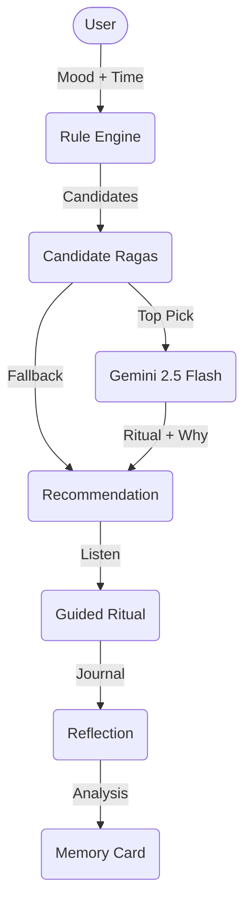

# 🎵 RagaChakra

> An AI Ritual Companion for Indian Classical Music.

[](https://opensource.org/licenses/MIT)
[](https://nodejs.org/)
[](https://reactjs.org/)
[](https://www.mongodb.com/)
[](https://deepmind.google/technologies/gemini/)

<!-- Beautiful banner placeholder -->
<!--  -->

---

## What is RagaChakra?

RagaChakra is an AI Ritual Companion for Indian Classical Music. 

Instead of passive, endless playlists, RagaChakra creates intentional listening rituals. It uses a hybrid AI architecture—combining a deterministic Hindustani music rule engine with Google's Gemini 2.5 Flash—to recommend the perfect Raga based on the current time of day (Prahar), your emotional state (Rasa), and astrological data.

## Problem

Modern recommendation systems optimize for engagement, keeping users passively scrolling. Users today need intentional listening. Traditional Hindustani music already contains profound, time-aware wisdom (the Prahar system) that dictates exactly when certain musical scales (Ragas) should be played to evoke specific emotions (Rasas). However, modern users cannot access this ancient knowledge easily. 

## Solution

RagaChakra guides users through a deliberate, mindful journey:

**Mood** 
↓ 
**AI Thinking** 
↓ 
**Recommendation** 
↓ 
**Music** 
↓ 
**Guided Ritual** 
↓ 
**Reflection** 
↓ 
**Memory**

## Features

- ✅ **Hybrid AI Recommendation**: Combines deterministic rules with Gemini 2.5 Flash.
- ✅ **Mood Check-in**: Aligns your current mood with classical Rasas.
- ✅ **Explainability Card**: "Why this Raga?" bullets explaining the AI's reasoning.
- ✅ **Confidence Score**: Transparent scoring (0-100) based on time match, mood overlap, and history.
- ✅ **Embedded Audio**: Listen to the recommended Raga immediately.
- ✅ **Guided Ritual**: Step-by-step meditative listening instructions generated by Gemini.
- ✅ **Reflection Journal**: Post-listening introspection space.
- ✅ **Memory Card**: AI-generated summary of your session and pattern detection.
- ✅ **Demo Mode**: Fallback scenario and mocked endpoints for presentations without API keys.

---

## Architecture

RagaChakra uses a hybrid approach to ensure musical and cultural accuracy.



## Hybrid AI

RagaChakra intentionally avoids pure LLM generation for music theory. It uses:

**Rule Engine (Backend) + Gemini 2.5 Flash**

Why?
- **Explainability**: The rule engine provides transparent scoring (time, mood, history).
- **Reliability**: Eliminates hallucinations about Raga times or scales.
- **Cultural Correctness**: MBTI and time rules strictly follow Hindustani tradition before Gemini touches the data.
- **Poetic Polish**: Gemini is used *only* where it excels—writing beautiful rituals, synthesizing reflections, and explaining the choice.

---

## Tech Stack

### Frontend
- **Framework**: React 18 (Vite)
- **Routing**: React Router DOM
- **Animation**: Framer Motion
- **Icons**: Lucide React
- **Time/Sun**: SunCalc

### Backend
- **Framework**: Express.js (Node.js)
- **Database ORM**: Mongoose (MongoDB)
- **Security**: Helmet, CORS, Express Rate Limit
- **Validation**: Express Validator

### AI
- **LLM**: `@google/generative-ai` (Gemini 2.5 Flash)

### Testing & Utilities
- **E2E**: Playwright
- **Unit**: Jest
- **Dev**: Concurrently, Nodemon

---

## Project Structure

```text
ragachakra/
├── client/          # Vite React Frontend
│   ├── src/         # React components, contexts, hooks, assets
│   ├── public/
│   └── package.json
├── server/          # Express Backend
│   ├── controllers/ # Route logic
│   ├── middleware/  # Rate limiting, DB guard
│   ├── models/      # Mongoose schemas (User, Raga)
│   ├── routes/      # Express routes (raga, mbti, schedule)
│   ├── services/    # AI recommendation pipelines
│   ├── utils/       # Time (prahar), ranking logic
│   ├── seed/        # Database seed scripts
│   └── index.js     # Server entry point
├── tests/           # Playwright E2E tests
├── package.json
└── README.md
```

---

## Screenshots

<!-- Recommendation Screenshot -->
<!--  -->

<!-- Ritual View -->
<!--  -->

<!-- Dashboard -->
<!--  -->

<!-- Reflection -->
<!--  -->

<!-- AI Thinking -->
<!--  -->

---

## Installation

1. **Clone the repository**
   ```bash
   git clone https://github.com/VibhuSuneja/personalmusic.git
   cd personalmusic
   ```

2. **Install all dependencies** (Frontend & Backend)
   ```bash
   npm run install:all
   ```

3. **Environment Variables**
   Create a `.env` file in the root directory based on `.env.example`:
   ```bash
   PORT=5000
   NODE_ENV=development
   MONGO_URI=mongodb+srv://<username>:<password>@cluster.mongodb.net/ragachakra?retryWrites=true&w=majority
   CLIENT_ORIGIN=http://localhost:5173
   GEMINI_API_KEY=your_google_gemini_api_key
   ASTRO_ENABLED=false
   ```

4. **Seed the Database** (Optional, loads base Ragas)
   ```bash
   npm run seed
   ```

5. **Start Development Servers** (Runs both Vite & Express)
   ```bash
   npm run dev
   ```

---

## Environment Variables

| Variable | Description |
|---|---|
| `PORT` | Backend server port (Default: 5000) |
| `NODE_ENV` | Environment mode (`development` or `production`) |
| `MONGO_URI` | MongoDB connection string |
| `CLIENT_ORIGIN` | Allowed CORS origin for frontend |
| `GEMINI_API_KEY` | Your Google Generative AI API Key |
| `ASTRO_ENABLED` | Set to `true` to enable Vedic astrology reranking features |
| `SERVE_FRONTEND` | Set to `true` to serve the React build statically via Express |

---

## API Overview

| Method | Endpoint | Purpose |
|---|---|---|
| `POST` | `/api/raga/recommend` | Get hybrid AI Raga recommendation |
| `POST` | `/api/raga/reflect` | Submit reflection, get Gemini summary |
| `GET` | `/api/raga/schedule/daily` | Get recommendations for all Prahars in a day |
| `GET` | `/api/raga/ai/explain` | SSE stream for real-time AI reasoning |
| `GET` | `/api/raga/demo` | Fetch mocked demo scenario (no DB/API key needed) |
| `GET` | `/api/raga/:id` | Fetch specific Raga details |
| `POST` | `/api/mbti` | Save user MBTI type and location context |
| `GET` | `/api/health` | Backend and DB health check |

---

## Demo

> **Live Demo**: [RagaChakra Live App](https://personalmusic.vercel.app/onboarding)

> **Demo Video**: [Watch on YouTube](https://youtu.be/6r-41If4VGI)

> **Pitch Deck**: [View Pitch Deck](https://www.genspark.ai/slides?project_id=5949eda2-accf-40fb-b01a-09a0a9041cc2)

---

## Future Roadmap

- Expand Raga database with rare Sandhi Prakash ragas
- Integrate Spotify/Apple Music for native audio playback
- Social listening rituals (synchronized group sessions)
- Mobile app version with offline fallback for retreats

---

## Author

- **Vibhu Suneja** 
  - GitHub: [@VibhuSuneja](https://github.com/VibhuSuneja)
  - LinkedIn: [Vibhu Suneja](#)

---

## License

This project is licensed under the [MIT License](LICENSE).
