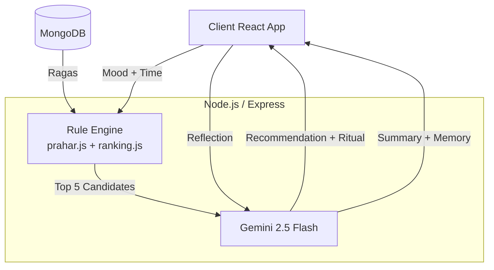

# RagaChakra

> **An AI Ritual Companion for Indian Classical Music.**

RagaChakra is a time-aware, emotionally intelligent companion that helps users discover the right raga at the exact right moment. It uses a **Hybrid AI Architecture** to combine the deterministic precision of classical music theory (Prahars, Thaats, Rasa) with the poetic, contextual reasoning of LLMs.

This is not a music player. It is a guide to listening rituals.

## 🏗 Architecture



### The Hybrid Pipeline
1. **Rule Engine (Fast & Reliable):** Filters ragas by current solar time (Prahar/Sandhi Prakash) and scores them based on the user's MBTI temperament.
2. **Gemini (Poetic & Contextual):** Takes the top candidates, selects the most appropriate one based on the user's *current mood*, and generates a guided listening ritual.

This guarantees reliability (time calculations never hallucinate) while providing deeply personalized explanations.

## 🚀 Features
- **Circadian Awareness:** Calculates precise solar times (dawn/dusk transitions) based on user geolocation.
- **Emotionally Intelligent Onboarding:** Starts with how you feel, not a search bar.
- **Explainable AI:** Transparent confidence scores and "Why?" bullets for every recommendation.
- **AI Memory Timeline:** Remembers your reflections and surfaces patterns in your listening journey.
- **Demo Mode:** A cinematic, fail-safe offline mode for presentations.

## 🛠 Tech Stack
- **Frontend:** React 18, Vite, Framer Motion, CSS Variables
- **Backend:** Node.js, Express, Mongoose, Helmet (Security)
- **AI/LLM:** Google Generative AI (Gemini 2.5 Flash)
- **Database:** MongoDB

## 📦 Setup & Installation

1. **Clone & Install**
   ```bash
   git clone <repo>
   cd personalmusic
   npm run install:all # (or npm install in both /client and /server)
   ```

2. **Environment Variables (`server/.env`)**
   ```env
   PORT=5000
   MONGO_URI=mongodb://localhost:27017/ragachakra
   GEMINI_API_KEY=your_key_here
   CLIENT_ORIGIN=http://localhost:5173
   ```

3. **Run Services**
   ```bash
   # Terminal 1 (Backend)
   cd server
   npm run dev

   # Terminal 2 (Frontend)
   cd client
   npm run dev
   ```

## 🔒 Security & Performance
- **Helmet** for HTTP header hardening.
- **Express-Rate-Limit** (tiered: 60/min standard, 10/min AI endpoints).
- **Express-Validator** for input sanitization.
- Graceful degradation: If MongoDB is down, the server returns 503 and the client falls back to `demoData.js`. If Gemini times out, the backend falls back to deterministic rule-engine reasoning.
